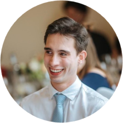
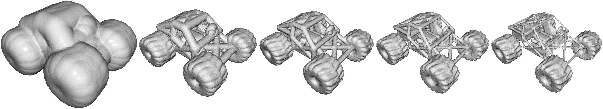

Small Steps and Level Sets: Fitting Neural Surface Models with Point Guidance (CVPR 2024)
---
Created by [Chamin Hewa Koneputugodage]( https://www.linkedin.com/in/chamin-hewa-koneputugodage-b3ba17148/), [Yizhak Ben-Shabat (Itzik)](http://www.itzikbs.com), [Dylan Campbell](https://sites.google.com/view/djcampbell) and [Stephen Gould](http://users.cecs.anu.edu.au/~sgould/) from [ANU](https://www.anu.edu.au/) and [Technion](https://www.technion.ac.il/).

<!-- __[Project page](https://chumbyte.github.io/OG-INR-Site/)&nbsp;/ [Paper](https://openreview.net/pdf?id=jSuYeWKw2Z)&nbsp;/ [Video](https://www.youtube.com/watch?v=Kh4Qohl2Zr8&ab_channel=anucvml)__ -->

<div align="center">
  <a href="https://www.linkedin.com/in/chamin-hewa-koneputugodage-b3ba17148/" target="blank">
    
  </a>
  <a href="https://www.itzikbs.com/" target="blank">
    
  </a>
  <a href="https://sites.google.com/view/djcampbell" target="blank">
    
  </a>
  <a href="https://cecs.anu.edu.au/people/stephen-gould/" target="blank">
    
  </a>
</div>

<div align="center">

</div>

## Introduction
This is the code for PG-SDF (Point-Guided SDF).

Please follow the installation instructions below.

## Instructions

### 1. Requirements

Our codebase uses [PyTorch](https://pytorch.org/). We use NerfStudio's implementation of an SDF field (based on Nerfacto but without hashes)

The code was tested with Python 3.7.9, torch 1.9.0, CUDA 11.3 on Ubuntu 18.04 (should work with later versions).
For a full list of requirements see [the `requirement.txt` file](requirements.txt). Note we also use `plotly-orca` for visualisation, which needs to be installed from conda.

```sh
conda create --name pgsdf -y python=3.8
conda activate pgsdf
pip install --upgrade pip
```
Following `https://github.com/nerfstudio-project/nerfstudio` we install nerfstudio
```
pip install torch==2.1.2+cu118 torchvision==0.16.2+cu118 --extra-index-url https://download.pytorch.org/whl/cu118
conda install -c "nvidia/label/cuda-11.8.0" cuda-toolkit
pip install ninja git+https://github.com/NVlabs/tiny-cuda-nn/#subdirectory=bindings/torch
pip install nerfstudio
```

Now install other requirements
```
pip install -r requirements.txt
conda install -c plotly plotly plotly-orca
```

Now build octree code (this is taken from [OG-INR](https://chumbyte.github.io/OG-INR-Site/)), and is used for octree based sampling from that paper
```sh
cd octree_base
python setup.py build_ext --inplace
cd ..
```
### 2. ShapeNet data
We use a subset of the [ShapeNet](https://shapenet.org/) data as chosen by [Neural Splines](https://github.com/fwilliams/neural-splines). This data is first preprocessed to be watertight as per the pipeline in the [Occupancy Networks repository](https://github.com/autonomousvision/occupancy_networks), who provide both the pipleline and the entire preprocessed dataset (73.4GB). 

The Neural Spline split uses the first 20 shapes from the test set of 13 shape classes from ShapeNet. We provide [a subset of the ShapeNet preprocessed data](https://drive.google.com/file/d/1h6TFHnza0axOZz5AuRkfyLMx_sFcu_Yf/view?usp=sharing) (the subset that corresponds to the split of Neural Splines) and [the resulting point clouds for that subset](https://drive.google.com/file/d/14CW_a0gS3ARJsIonyqPc5eKT3iVcCWZ0/view?usp=sharing). 

These can be downloaded via terminal into the data directory (783.76MB download) by running 
```
cd data
./download_shapenet.sh
cd ..
```

If you use this data in your research, make sure to cite the ShapeNet and Occupancy Network papers, and if you report on this split, compare and cite to the Neural Spline paper.

### 3. Surface Reconstruction
To optimise, run ```python main.py```
The possible configuration options are in the `PGSDF_Config` dataclass. In the `__main__()` function there are three options, optimise on a single shape, optimise on all shapes in the dataset or to optimise on the subset of 20 shapes with the highest SION. 
The most important options to set are the path to the data `shapenet_path`, the output folder `log_dir`, and if you are training a single shape then its `shape_class` and `shape_name`.

To run metrics, run `python compute_metrics_shapenet_single.py`, `python compute_metrics_shapenet_all_shapes.py` or `python compute_metrics_shapenet_top20subset.py` depending on what type of experiment you are running metrics on. This requires setting the options under `# Manually set the following`, such as data paths and shape identifiers.

### 4. SION
Our code for computing SION is in `sion.py` and our results for the ShapeNet dataset are in `sion.pkl`.

## Thanks

This is heavily based of our [DiGS codebase](https://github.com/Chumbyte/DiGS) and our [OG-INR codebase](https://github.com/Chumbyte/OG-INR). Other major components include [NerfStudio](https://github.com/nerfstudio-project/nerfstudio) and [SDFStudio](https://github.com/autonomousvision/sdfstudio) for efficient SDF fields utilising [tiny-cuda-nn](https://github.com/NVlabs/tiny-cuda-nn), [keops](https://github.com/getkeops/keops) for fast kernel operations (we use for distance based computations) and [Pytorch3D](https://github.com/facebookresearch/pytorch3d) for the implementation of farthest point sampling. We also use `trimesh` and `open3d` for manipulating 3D data, `cython` for efficiently implementing the Octree code, `rerun` for an interactive view of the optimisation, `pyrallis` for easy configs and arguments, and `wandb` for optional logging.

Y. Ben-Shabat is supported by the Marie Sklodowska-Curie grant agreement No. 893465 S. Gould is a recipient of an ARC Future Fellowship (proj. no. LP200100421)
funded by the Australian Government.

## Citation

If you find our work useful in your research, please cite our paper:

```bibtex
@InProceedings{Koneputugodage_2024_CVPR,
    author    = {Koneputugodage, Chamin Hewa and Ben-Shabat, Yizhak and Campbell, Dylan and Gould, Stephen},
    title     = {Small Steps and Level Sets: Fitting Neural Surface Models with Point Guidance},
    booktitle = {Proceedings of the IEEE/CVF Conference on Computer Vision and Pattern Recognition (CVPR)},
    month     = {June},
    year      = {2024},
    pages     = {21456-21465}
}
```
